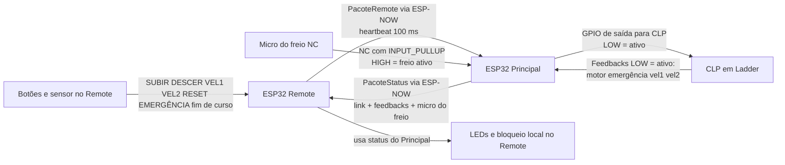

# Design Specification — Controle Remoto para Carrinho de Jet Ski

**Versão:** 4.0
**Data:** 2026-04-17
**Status:** Em execução

---

## 1. Visão Geral

O sistema moderniza o controle de um carrinho de transporte de jet skis movido por guincho motorizado. A operação, antes restrita a um painel fixo no depósito, passa a ser realizada por controle remoto sem fio, permitindo que o operador acompanhe o equipamento ao longo de todo o trajeto entre o depósito e a margem do rio.

A **prioridade absoluta do sistema é a segurança (Fail-Safe):** qualquer falha de comunicação ou acionamento de emergência resulta no sinal de emergência sendo enviado imediatamente ao CLP, que aplica o freio mecânico.

> **Nota arquitetural (v4.0):** interferência eletromagnética do motor e do inversor (VFD) comprometia a operação dos ESP32 como controladores. A partir desta versão, um **CLP programado em Ladder** gerencia toda a lógica de controle (motor, freio, estados, segurança). Os ESP32 atuam exclusivamente como **pontes de comunicação** sem fio.

---

## 2. Arquitetura do Sistema

O sistema utiliza dois ESP32 comunicando-se via **ESP-NOW** (peer-to-peer, sem roteador), com um **CLP** como controlador central de segurança e lógica de motor.

```
┌─────────────────────────────────┐
│     MÓDULO REMOTE               │
│  (Carrinho / Escravo)           │
│                                 │
│  - ESP32                        │
│  - Botões: SUBIR, DESCER,       │
│    VEL1, VEL2, RESET,           │
│    EMERGÊNCIA (c/ trava),       │
│    fim de curso descida         │
│  - LEDs de status               │
│  - Bateria + Enclosure IP54     │
└─────────────────────────────────┘
              │ ESP-NOW
              │ PacoteRemote (comandos + heartbeat)
              ▼
┌──────────────────────────────────┐
│     MÓDULO PRINCIPAL             │
│  (Bridge ESP↔CLP)                │
│                                  │
│  - ESP32                         │
│  - 7 saídas GPIO → CLP inputs    │
│  - 4 entradas GPIO ← feedback CLP│
│  - 1 entrada GPIO ← micro freio  │
│  - 2 botões de teste local       │
│  - LED LINK                      │
│  - Alimentação rede elétrica     │
└──────────────────────────────────┘
      │ GPIO outputs      ▲ GPIO inputs
      │ ativo em LOW/GND  │ pull-up interno
      ▼                   │
┌──────────────────────────────────┐
│     CLP (Ladder)                 │
│                                  │
│  - Lógica de controle completa   │
│  - Motor, freio, velocidade      │
│  - Máquina de estados            │
│  - Segurança e emergência        │
└──────────────────────────────────┘
```

### 2.1 Fluxo de Comunicação



**Lógica de nível GPIO → CLP:** ativo em LOW (GND)
- LOW = sinal ativo → CLP lê como entrada acionada
- HIGH = sinal inativo (repouso)
- Inicialização: todos os GPIOs em HIGH

**Lógica de feedback CLP → Principal:** `INPUT_PULLUP`
- LOW = feedback ativo do CLP
- HIGH = feedback inativo
- Micro do freio NC: LOW = normal, HIGH = micro aberta/acionada

### 2.2 Fail-Safe

Se o Remote ficar silencioso por mais de `WATCHDOG_TIMEOUT_MS` (500 ms):
1. `PIN_CLP_EMERGENCIA` vai a LOW imediatamente → CLP recebe emergência
2. Todos os sinais de movimento voltam a HIGH (inativos)
3. Comunicação restaurada → `PIN_CLP_EMERGENCIA` volta a HIGH

---

## 3. Descrição dos Módulos

### 3.1 Módulo Principal (Bridge ESP↔CLP)

| Item | Descrição |
|---|---|
| Microcontrolador | ESP32 |
| Localização | Painel fixo no estacionamento/depósito |
| Alimentação | Fonte derivada da rede elétrica 110/220V |
| Entradas físicas | 2 botões de teste local + 4 feedbacks do CLP + 1 micro do freio |
| Saídas GPIO → CLP | 7 GPIOs (ativo em LOW/GND): SUBIR, DESCER, VEL1, VEL2, EMERGÊNCIA, RESET, FIM_CURSO |
| Entradas GPIO ← CLP | 4 GPIOs (INPUT_PULLUP): MOTOR_ATIVO, EMERGÊNCIA_ATIVA, VEL1_ATIVA, VEL2_ATIVA |
| Entrada GPIO ← hardware | 1 GPIO (INPUT_PULLUP): micro do freio NC |
| LED | LINK (GPIO 21) — indica link ativo com Remote |
| Comunicação | ESP-NOW — recebe `PacoteRemote` do Remote; envia `PacoteStatus` com link e feedbacks |

### 3.2 Módulo Remote (Carrinho)

| Item | Descrição |
|---|---|
| Microcontrolador | ESP32 |
| Localização | Embarcado no carrinho de transporte |
| Alimentação | Bateria recarregável (ex: Li-Ion 18650 + regulador 3.3V) |
| Entradas | Botões: SUBIR (hold), DESCER (hold), VEL1, VEL2, EMERGÊNCIA (c/ trava); fim de curso descida |
| Saídas LEDs | GPIOs dedicados: LINK, MOTOR, VEL1, VEL2, EMERGÊNCIA |
| Comunicação | ESP-NOW — transmite `PacoteRemote` e heartbeat para o Principal |

> O Remote não possui relés. Todos os seus LEDs são GPIOs dedicados.

---

## 4. Arquitetura de Hardware — GPIOs e Ligações

### 4.1 Saídas GPIO do Principal → Entradas do CLP

O ESP Principal conecta suas saídas GPIO a um **módulo de relé 5V**; os contatos desse módulo então acionam as entradas digitais do CLP via GND:

```
GPIO ESP32 (OUTPUT)
    │
    └──► IN do módulo de relé 5V
         │
         └──► Contato do relé → Entrada digital do CLP
              (GND compartilhado entre ESP32, relé e CLP)
```

**Lógica:** LOW (GND) = sinal ativo; HIGH = inativo.

| Sinal | GPIO ESP | Pino CLP | Tipo | Comportamento |
|---|---|---|---|---|
| SUBIR | 4 | Entrada CLP | Nível | LOW estável enquanto hold remoto SUBIR permanecer válido |
| DESCER | 16 | Entrada CLP | Nível | LOW estável enquanto hold remoto DESCER permanecer válido |
| VEL1 | 17 | Entrada CLP | Pulso | LOW por 50 ms ao selecionar VEL1 |
| VEL2 | 5 | Entrada CLP | Pulso | LOW por 50 ms ao selecionar VEL2 |
| EMERGÊNCIA | 18 | Entrada CLP | Nível | LOW se emergência Remote OU watchdog expirado |
| RESET | 19 | Entrada CLP | Pulso | LOW por 50 ms ao pressionar RESET |
| FIM_CURSO | 22 | Entrada CLP | Nível | LOW quando carrinho na posição final de descida |

### 4.2 Entradas GPIO do Principal ← CLP / Hardware

O ESP Principal lê feedbacks digitais do CLP e a micro do freio com `INPUT_PULLUP`.

| Sinal | GPIO ESP | Origem | Lógica | Comportamento |
|---|---|---|---|---|
| MOTOR_ATIVO | 23 | CLP | LOW = ativo | CLP informa motor em operação |
| EMERGÊNCIA_ATIVA | 25 | CLP | LOW = ativo | CLP informa emergência ativa |
| VEL1_ATIVA | 26 | CLP | LOW = ativo | CLP informa velocidade 1 ativa |
| VEL2_ATIVA | 27 | CLP | LOW = ativo | CLP informa velocidade 2 ativa |
| MICRO_FREIO | 14 | Micro NC | HIGH = freio ativo | Micro do freio indica freio aplicado; LOW = freio liberado |

### 4.3 Entradas de Teste Local (sem Remote)

Botões físicos no Principal para acionar o CLP diretamente durante testes, sem necessidade do Módulo Remote. Quando pressionados, resetam o watchdog internamente para evitar emergência por timeout.

| Botão | GPIO | Tipo | Lógica | Comportamento |
|---|---|---|---|---|
| TESTE SUBIR | 32 | Táctil | INPUT_PULLUP (LOW = ativo) | Ativa `PIN_CLP_SUBIR` LOW enquanto pressionado |
| TESTE DESCER | 33 | Táctil | INPUT_PULLUP (LOW = ativo) | Ativa `PIN_CLP_DESCER` LOW enquanto pressionado |

> Prioridade: pacote Remote tem precedência. Botões de teste só atuam quando nenhum pacote foi recebido naquele ciclo de loop.

### 4.4 Fim de Curso de Descida

O sensor de fim de curso de descida está conectado ao **ESP32 Remote** (GPIO 36). Quando acionado:
- O Remote inclui `fim_curso_descida = 1` no `PacoteRemote`
- O Principal replica o sinal em `PIN_CLP_FIM_CURSO` (LOW) para o CLP
- O CLP trata a lógica de bloqueio de descida

### 4.5 Fail-Safe de Comunicação

Se o Remote ficar silencioso por mais de 500 ms (watchdog do Principal):
1. `PIN_CLP_EMERGENCIA` = LOW → CLP aplica freio imediatamente
2. `PIN_CLP_SUBIR` e `PIN_CLP_DESCER` = HIGH (movimento inativo)
3. Quando comunicação é restaurada: `PIN_CLP_EMERGENCIA` = HIGH automaticamente

---

## 5. Pinout Resumido

### 5.1 Módulo Principal

| Função | Tipo | GPIO | Lógica |
|---|---|---|---|
| CLP — SUBIR | Saída | 4 | LOW = ativo (SUBIR hold) |
| CLP — DESCER | Saída | 16 | LOW = ativo (DESCER hold) |
| CLP — VEL1 | Saída | 17 | LOW = pulso 50 ms |
| CLP — VEL2 | Saída | 5 | LOW = pulso 50 ms |
| CLP — EMERGÊNCIA | Saída | 18 | LOW = emergência ativa |
| CLP — RESET | Saída | 19 | LOW = pulso 50 ms |
| CLP — FIM_CURSO | Saída | 22 | LOW = fim de curso descida ativo |
| LED LINK | Saída | 21 | HIGH = aceso (link com Remote OK) |
| TESTE SUBIR | Entrada | 32 | INPUT_PULLUP — LOW = pressionado |
| TESTE DESCER | Entrada | 33 | INPUT_PULLUP — LOW = pressionado |
| FB MOTOR_ATIVO | Entrada | 23 | INPUT_PULLUP — LOW = ativo |
| FB EMERGÊNCIA_ATIVA | Entrada | 25 | INPUT_PULLUP — LOW = ativo |
| FB VEL1_ATIVA | Entrada | 26 | INPUT_PULLUP — LOW = ativo |
| FB VEL2_ATIVA | Entrada | 27 | INPUT_PULLUP — LOW = ativo |
| MICRO_FREIO | Entrada | 14 | INPUT_PULLUP — HIGH = freio ativo |
| **Total** | | **15** | **7 entradas + 8 saídas** |

> Todos os GPIOs inicializados em HIGH (inativo) no boot.
> GPIOs 0, 2, 12 e 15 evitados (strapping pins de boot).
> GPIOs 34, 35, 36, 39 (input-only no ESP32) não utilizados no Principal.

### 5.2 Módulo Remote

| Função | Tipo | GPIO | Observação |
|---|---|---|---|
| Botão SUBIR | Entrada | 32 | Pull-up interno (INPUT_PULLUP) — LOW = pressionado |
| Botão DESCER | Entrada | 33 | Pull-up interno (INPUT_PULLUP) — LOW = pressionado |
| Botão VEL1 | Entrada | 39 (VN) | Input-only, pull-up externo obrigatório |
| Botão VEL2 | Entrada | 34 | Input-only, pull-up externo obrigatório |
| Botão RESET | Entrada | 255 | Desabilitado nesta versão |
| Botão EMERGÊNCIA (trava) | Entrada | 13 | Pull-up interno (INPUT_PULLUP) — NC, HIGH = ativo |
| Fim de curso descida | Entrada | 36 (VP) | Input-only, pull-up externo obrigatório — LOW = carrinho na posição final |
| LED LINK | Saída | 4 | Comunicação com Principal |
| LED MOTOR | Saída | 16 | Pisca enquanto aguarda liberação do freio e partida; fixo com `motor_ativo == 1` |
| LED VEL1 | Saída | 17 | Velocidade 1 reportada pelo CLP |
| LED VEL2 | Saída | 5 | Velocidade 2 reportada pelo CLP |
| (não utilizado) | — | 18 | Antes VEL3 |
| LED EMERGÊNCIA | Saída | 19 | Emergência ativa piscando |
| **Total** | | **11** | **6 entradas ativas + 5 LEDs ativos** |

> GPIOs 34, 36 e 39 requerem pull-up externo obrigatório (10kΩ para 3.3V).
> GPIOs 13, 32 e 33 usam pull-up interno via INPUT_PULLUP.
> Restrições de boot do ESP32 respeitadas: GPIOs 0, 2, 12 e 15 evitados.

---

## 6. Regras de Negócio

### 6.1 Controle de Velocidade

- O sistema possui **2 níveis de velocidade** (VEL1, VEL2), selecionados por botões de **pulso** no Remote.
- O ESP Principal envia um pulso de 50 ms para a entrada CLP correspondente ao selecionar.
- O CLP gerencia qual nível está ativo e a comutação entre eles.
- Os LEDs VEL1/VEL2 no Remote refletem o feedback recebido do CLP via `PacoteStatus`.

### 6.2 Acionamento do Motor — Regra "Homem-Morto"

- O motor **só permanece em operação enquanto SUBIR ou DESCER estiver mantido pressionado** no Remote.
- O Remote só envia `SUBIR` ou `DESCER` quando o status do Principal é válido, a emergência local não está ativa e o CLP não está reportando emergência ativa.
- No Principal, `SUBIR` ou `DESCER` remotos só energizam a saída correspondente enquanto o hold permanecer válido e as condições de bloqueio estiverem liberadas.
- Ordem de prioridade no Principal: perda de link/watchdog e emergência sempre impedem operação remota.
- Além disso, operação remota de `SUBIR` ou `DESCER` só é permitida quando `micro_freio_ativa == 0` e `motor_ativo == 1`.
- O Remote transmite `botao_hold = 1` enquanto o botão está pressionado.
- Ao pressionar SUBIR ou DESCER, o LED `MOTOR` do Remote pisca enquanto o freio ainda está aplicado (`micro_freio_ativa == 1`) ou enquanto o CLP ainda não reportou `motor_ativo == 1`.
- O LED `MOTOR` só passa a ficar aceso fixo quando o Principal reporta simultaneamente `micro_freio_ativa == 0` e `motor_ativo == 1`.
- Ao soltar: `PIN_CLP_SUBIR` ou `PIN_CLP_DESCER` volta a HIGH → CLP corta motor e aplica freio.
- A lógica de execução (dead-time, freio) é inteira responsabilidade do CLP.

### 6.3 Emergência

- Botão EMERGÊNCIA no Remote (NC com trava): HIGH = emergência ativa.
- `PIN_CLP_EMERGENCIA` vai a LOW enquanto `emergencia == 1` no pacote.
- Watchdog timeout também ativa `PIN_CLP_EMERGENCIA` (Remote silencioso = emergência).
- O CLP aplica freio e bloqueia movimento ao receber o sinal de emergência.

### 6.4 RESET

- O comando `RESET` permanece previsto no protocolo para compatibilidade com o CLP.
- No pinout atual do Remote, `PIN_BTN_RESET = 255`, ou seja, não há botão físico dedicado a RESET nesta versão.
- Se esse comando voltar a existir no hardware do Remote, o Principal já está preparado para gerar pulso de 50 ms em `PIN_CLP_RESET`.

---

## 7. Protocolos de Segurança e Emergência (Fail-Safe)

### 7.1 Condições de Acionamento de Emergência no CLP

| # | Condição | Origem | Sinal para CLP |
|---|---|---|---|
| 1 | Botão EMERGÊNCIA no Remote | Remote → ESP-NOW → Principal | `PIN_CLP_EMERGENCIA` LOW |
| 2 | Remote silencioso > 500 ms (watchdog) | Principal (watchdog) | `PIN_CLP_EMERGENCIA` LOW |
| 3 | Desligamento / queda de bateria do Remote | Principal (watchdog) | `PIN_CLP_EMERGENCIA` LOW |
| 4 | Soltura do botão de direção (Homem-Morto) | Remote → Principal | `PIN_CLP_SUBIR` e `PIN_CLP_DESCER` HIGH |

> O CLP decide como reagir a cada sinal — corte de motor, aplicação de freio, bloqueio de movimento, etc.

### 7.2 Botão de Emergência NC com Trava Mecânica

Botões de emergência são do tipo **NC (normalmente fechado) com trava**: em repouso o contato está fechado (pino LOW); ao pressionar, o contato abre e o pull-up puxa o pino para HIGH (emergência ativa), permanecendo assim até destravar manualmente. O firmware lê o nível contínuo do pino.

> **Fail-safe:** cabo partido ou desconexão resulta em pino HIGH → `emergencia = 1` no pacote → `PIN_CLP_EMERGENCIA` LOW.

**Liberação da emergência:**
- Operador destravar o botão de emergência no Remote → `emergencia = 0` → `PIN_CLP_EMERGENCIA` HIGH
- Se watchdog estava expirado: restaurar comunicação → `PIN_CLP_EMERGENCIA` HIGH automaticamente
- RESET no Remote pode ser usado para solicitar rearme ao CLP (lógica definida no Ladder)

### 7.3 Watchdog de Comunicação (Principal)

- Timeout: **500 ms** (`WATCHDOG_TIMEOUT_MS`)
- Remote envia heartbeat a cada **100 ms**
- Ao expirar: `PIN_CLP_EMERGENCIA` LOW + todos os sinais de movimento HIGH
- Ao restaurar: `PIN_CLP_EMERGENCIA` HIGH automaticamente (sem necessidade de RESET manual no ESP)
- O CLP define se exige RESET após watchdog — configurado no Ladder

---

## 8. Máquina de Estados (CLP)

A máquina de estados é executada inteiramente no CLP (Ladder). O ESP Principal apenas replica os sinais recebidos do Remote:

| Sinal ESP → CLP | Nível | Significado para o CLP |
|---|---|---|
| `PIN_CLP_SUBIR` | LOW | Operador mantendo SUBIR pressionado e condições remotas liberadas |
| `PIN_CLP_DESCER` | LOW | Operador mantendo DESCER pressionado e condições remotas liberadas |
| `PIN_CLP_VEL1` | Pulso LOW 50ms | Selecionar velocidade 1 |
| `PIN_CLP_VEL2` | Pulso LOW 50ms | Selecionar velocidade 2 |
| `PIN_CLP_EMERGENCIA` | LOW | Emergência ativa (botão ou watchdog) |
| `PIN_CLP_RESET` | Pulso LOW 50ms | Reset / rearme |
| `PIN_CLP_FIM_CURSO` | LOW | Carrinho na posição final de descida |

---

## 9. Protocolo de Comunicação (ESP-NOW)

### 9.1 Emparelhamento

Ambos os módulos iniciam em modo de descoberta usando **broadcast** como peer inicial. O MAC real do peer é detectado dinamicamente a partir do primeiro pacote válido recebido, e o peer é registrado automaticamente via `esp_now_add_peer()`.

### 9.2 Pacote Remote → Principal (9 bytes)

```c
typedef struct {
    uint8_t  comando;            // 0=HEARTBEAT, 1=SUBIR, 2=DESCER,
                                 // 3=VEL1, 4=VEL2, 5=RESET
    uint8_t  botao_hold;         // 1=SUBIR ou DESCER pressionado
    uint8_t  emergencia;         // 1=botão com trava ativo no Remote
    uint8_t  fim_curso_descida;  // 1=carrinho na posição final de descida
    uint32_t timestamp;          // millis() do Remote
    uint8_t  checksum;           // XOR de todos os bytes anteriores
} PacoteRemote;
```

### 9.3 Pacote Principal → Remote (Status) (7 bytes)

O Principal informa ao Remote se o link está válido e replica os feedbacks atuais do CLP e da micro do freio.

```c
typedef struct {
    uint8_t  link_ok;             // 1=Principal ativo e recebendo pacotes do Remote
    uint8_t  motor_ativo;         // 1=CLP reporta motor ativo
    uint8_t  emergencia_ativa;    // 1=CLP reporta emergencia ativa
    uint8_t  vel1_ativa;          // 1=CLP reporta velocidade 1 ativa
    uint8_t  vel2_ativa;          // 1=CLP reporta velocidade 2 ativa
    uint8_t  micro_freio_ativa;   // 1=freio ativo; 0=freio liberado
    uint8_t  checksum;            // XOR de todos os bytes anteriores
} PacoteStatus;
```

### 9.4 Frequência de Envio

| Direção | Condição | Frequência |
|---|---|---|
| Remote → Principal | Heartbeat | A cada 100 ms |
| Remote → Principal | Mudança de estado | Imediato + repetir a cada 100 ms |
| Principal → Remote | Status | A cada 200 ms ou imediato em mudança de estado |

---

## 10. Indicadores Visuais (LEDs)

Todos os LEDs são componentes discretos de **3V (padrão Arduino)**, cor definida fisicamente. O firmware controla apenas o estado lógico do GPIO.

### 10.1 LEDs no Módulo Principal

| LED | GPIO | Aceso quando |
|---|---|---|
| LINK | 21 | Link ativo com Remote (watchdog OK) — pisca 2 Hz se sem link |

> Os GPIOs de saída ao CLP (4, 16, 17, 5, 18, 19, 22) não possuem LEDs associados nesta arquitetura.

### 10.2 LEDs no Módulo Remote (GPIOs dedicados)

LEDs baseados no `PacoteStatus` recebido do Principal:

| LED | GPIO | Comportamento | Condição |
|---|---|---|---|
| LINK | 4 | Ligado fixo | `link_ok == 1` e status recebido há <= 500 ms |
| LINK | 4 | Piscando 1 Hz | Timeout > 500 ms sem resposta do Principal |
| MOTOR | 16 | Ligado fixo | `motor_ativo == 1` |
| MOTOR | 16 | Piscando 2 Hz | SUBIR/DESCER pressionado e ainda aguardando `micro_freio_ativa == 0` com `motor_ativo == 1` |
| MOTOR | 16 | Desligado | Sem solicitação de movimento e `motor_ativo == 0` |
| VEL1 | 17 | Ligado fixo | `vel1_ativa == 1` |
| VEL2 | 5 | Ligado fixo | `vel2_ativa == 1` |
| EMERGÊNCIA | 19 | Piscando 4 Hz | Botão emergência local ativo |
| EMERGÊNCIA | 19 | Piscando 4 Hz | `emergencia_ativa == 1` |

---

## 11. Sistema de Logging (Debug/Testes)

O firmware inclui um sistema de logging via **Serial** (115200 baud) para facilitar testes e depuração antes do deploy em produção. O sistema registra transições de estado e ações relevantes, **não** estados repetidos a cada ciclo do loop.

### 11.1 Formato das Mensagens

```
[timestamp_ms] [NIVEL] [MODULO] mensagem
```

Níveis: `INFO` (operação normal), `WARN` (alerta/bloqueio), `ERRO` (falha).

### 11.2 Módulos Monitorados — Principal

| Tag | Eventos logados |
|---|---|
| `CLP` | Sinais enviados ao CLP (SUBIR, DESCER, VEL1/2, EMERGÊNCIA, RESET, FIM_CURSO) |
| `WDOG` | Watchdog expirado/recuperado |

### 11.3 Módulos Monitorados — Remote

| Tag | Eventos logados |
|---|---|
| `BOTAO` | Pressionar/soltar SUBIR, DESCER, VEL1/2, RESET, EMERGÊNCIA |
| `LINK` | Comunicação perdida/restabelecida com o Principal |

### 11.4 Exemplo de Saída Serial — Principal

```
[1523] [INFO] [CLP] Sinal SUBIR enviado ao CLP
[5012] [INFO] [CLP] Sinal SUBIR — GPIO voltou a HIGH (botao solto)
[9100] [ERRO] [WDOG] Watchdog EXPIRADO — emergencia ativada no CLP
[9600] [INFO] [WDOG] Watchdog recuperado — emergencia CLP liberada
```

### 11.5 Desabilitar em Produção

Adicionar no `platformio.ini` do módulo desejado:

```ini
build_flags = -DLOG_DISABLED
```

Com `LOG_DISABLED`, todas as macros de logging compilam como no-op (zero overhead em Flash e RAM).

### 11.6 Arquivo Compartilhado

O módulo de logging é implementado em `logger.h` (header-only), idêntico em `principal/include/` e `remote/include/`. Inclui macros de logging e função auxiliar `comandoParaString()` para saída legível.

---

## 12. Requisitos Não-Funcionais

- **Latência ESP:** < 100 ms entre botão pressionado e sinal chegando ao CLP.
- **Watchdog:** Timeout padrão 500 ms — emergência ao CLP se Remote silencioso.
- **Alcance:** Mínimo 50 metros em linha de visada.
- **Robustez:** Enclosure Remote mínimo IP54.
- **Segurança elétrica:** CLP e ESP32 com GND comum; isolação galvânica recomendada entre rede elétrica e lógica de controle.
- **Pulso CLP:** 50 ms mínimo para garantir leitura de sinais VEL1/VEL2/RESET pelo CLP.
- **Fim de curso descida:** Debounce mínimo 20 ms no Remote.

---

## 13. Fora de Escopo (v1.0)

- ~~Fim de curso na posição inferior (margem do rio).~~ — **implementado** (Remote GPIO 36)
- Display LCD/OLED.
- Controle por aplicativo mobile.
- Registro persistente de logs de operação (logs via Serial para debug estão disponíveis — ver §11).
- Múltiplos remotes simultâneos.

---

## 14. Glossário

| Termo | Definição |
|---|---|
| ESP-NOW | Protocolo de comunicação sem fio da Espressif, direto entre dispositivos, sem roteador |
| CLP | Controlador Lógico Programável — executa a lógica de controle em Ladder |
| Bridge ESP↔CLP | Papel do ESP Principal: recebe ESP-NOW do Remote, replica sinais ao CLP e devolve feedbacks ao Remote |
| Watchdog | Timer de supervisão no ESP Principal — se Remote ficar silencioso > 500 ms, aciona emergência no CLP |
| Homem-Morto | Regra que exige botão mantido pressionado para o motor permanecer ativo |
| Fail-Safe | Qualquer falha de comunicação resulta em emergência ativa no CLP |
| Ativo em LOW | Lógica de comunicação ESP→CLP: GPIO LOW (GND) = sinal ativo para o CLP |
| Botão NC com Trava | Botão normalmente fechado (NC) com trava: repouso = LOW; pressionado = HIGH (contato abre, pull-up ativa). Cabo partido = HIGH = emergência (fail-safe). |
| Pulso CLP | Sinal LOW de 50 ms enviado ao CLP para comandos de pulso (VEL1, VEL2, RESET) |
